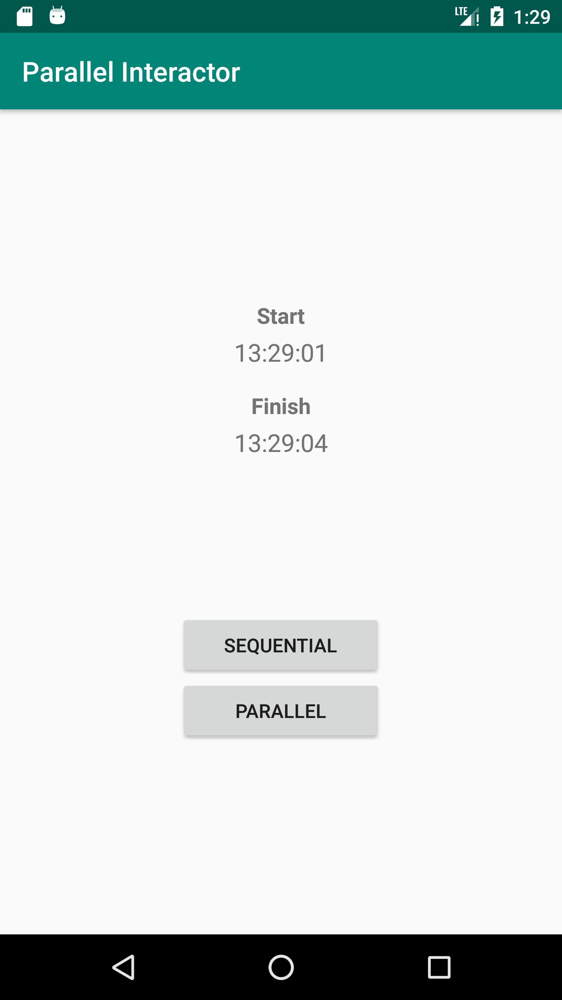

# Parallel Interactor

Android project that is part of a [blog post](https://joseangelmaneiro.com/interactor-kotlin-coroutines/) where the [Kotlin coroutines](https://kotlinlang.org/docs/reference/coroutines/basics.html) are used to manage asynchrony in interactors (Clean Architecture).

